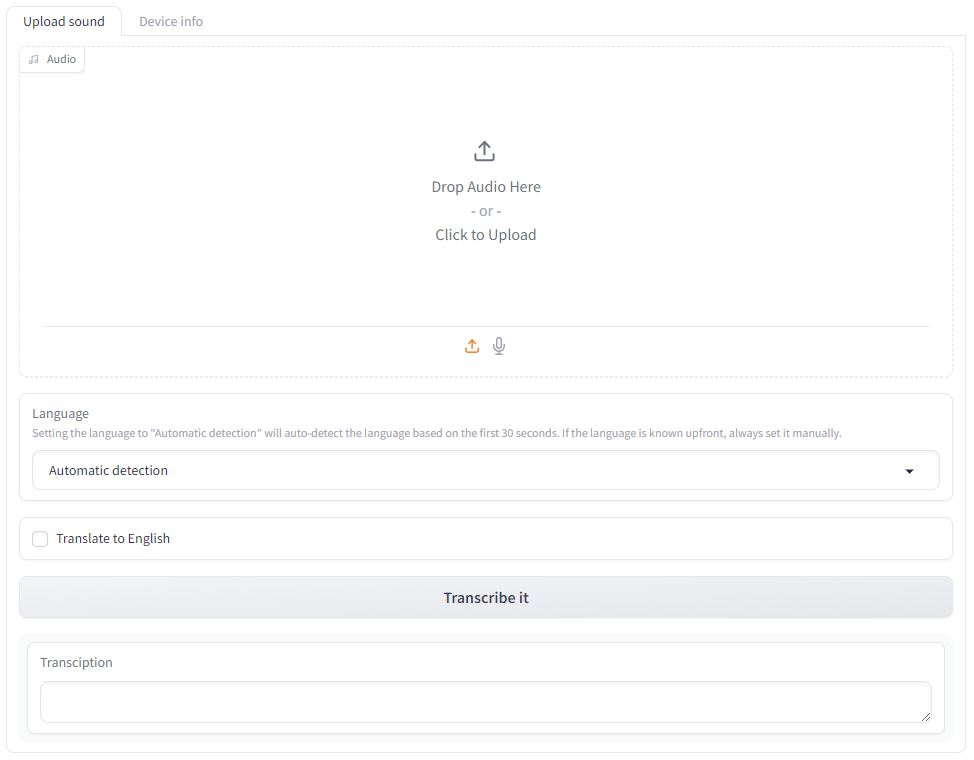

# Automatic speech recognition

Automatic speech recognition uses [Whisper](https://github.com/openai/whisper) to transcribe audio files and [pyannote-audio](https://github.com/pyannote/pyannote-audio) to add speaker diarization.

It has optimized inference because of batching and Scale-Product-Attention (SDPA) or flash attention (if available).

> :warning: **Always review transcriptions.** Transcriptions are done using AI models which are never 100% accurate.

The repo contains (will contain) code to run the software

- as a command-line tool
- as graphical interface
- as an inference API

## Installation

### Prerequisites

The host machine must have an NVidia graphics card with CUDA 12.x installed natively, preferably [CUDA 12.1](https://developer.nvidia.com/cuda-12-1-0-download-archive), even when using Docker.

The graphics card should have at least 12GB VRAM for the largest model.

The host machine must have Docker installed.

For a Linux server, follow [these instructions](https://docs.docker.com/engine/install/)

For a desktop (visual UI available), follow [these instructions](https://www.docker.com/products/docker-desktop/)

### Docker (recommended)

Build the Docker image

`docker build -t asr .` (make sure Docker is running on your system)

Run the Docker image, forward port 7860 (Gradio) and pass your GPU(s) to the container

`docker run -p 7860:7860 --gpus all asr`

Or in detached mode (in background)

`docker run -d -p 7860:7860 --gpus all asr`

You can check whether it is running with

`docker ps`

If you want to follow terminal output of a detached container, you can use

`docker logs -f <first n digits of the container id>`

The first time a transcription is requested, it will download the model.
To avoid this happening each time, make sure you stop and start the same container, instead of using

`docker run ...` again

use `docker start <first n digits of container>`

You can find the list of all containers, also stopped ones by using

`docker ps -a`

To open the app, open your **browser** and go to `localhost:7860`

### Dev Container

Open the project Visual Studio Code and use CTRL + SHIFT + P and type "Rebuild and reopen in container".

After building, open up a terminal and activate the virtual environment

`source /home/jovyan/venv/bin/activate`

Then run the app

`python src/app.py`

## License

GNU General Public License v3.0 or later

See [COPYING](COPYING) to see the full text.
